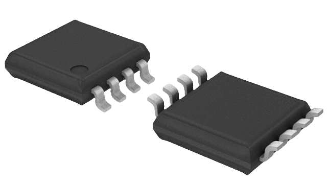
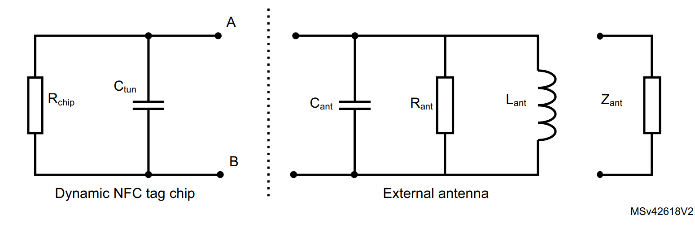
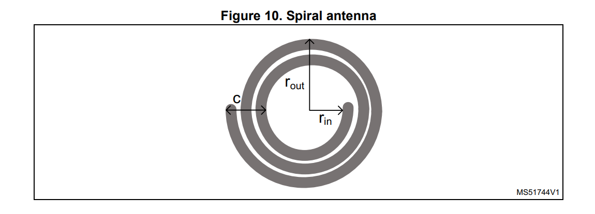
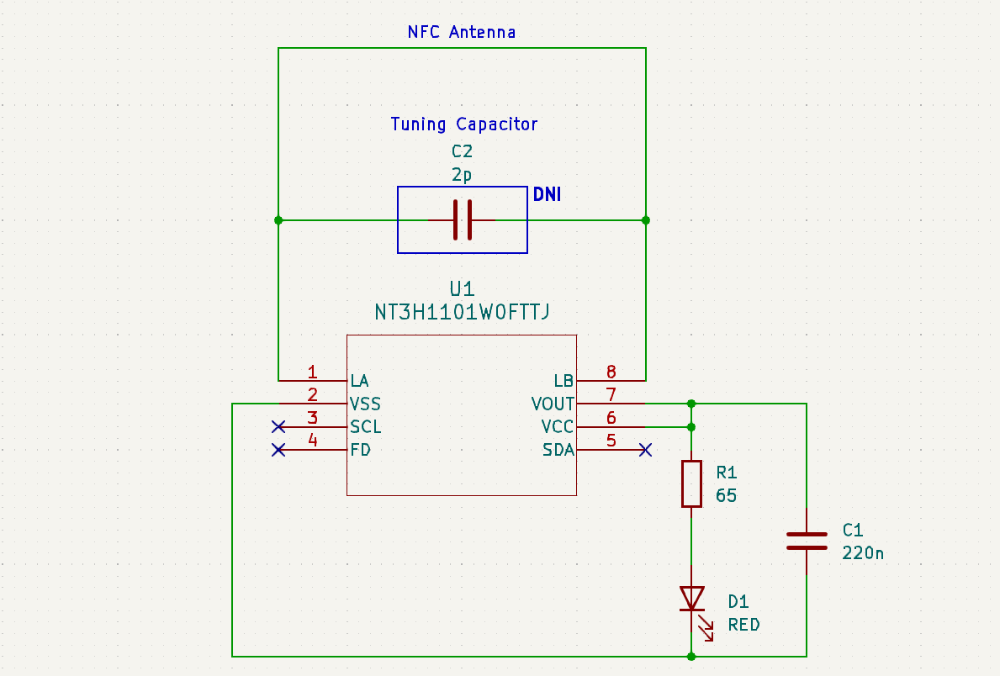

# PCB Business Card 💳
The following project is a PCB designed as a business card. This card contains an integrated NFC tag that allows you to share your contact information wirelessly.

    

<i>Blender Render</i>

## NFC Principle 🧲
<b>[NFC (Near Field Communication)](https://www.spiceworks.com/tech/networking/articles/what-is-near-field-communication/)</b> is a group of communication protocols that allows for low speed wireless communication between two electronic devices. 
* NFC communication occurs when both electronic devices are within a distance of 4cm or less. 
* NFC operates at 13.56 MHz on ISO/IEC 18000-3 air interface and at rates ranging from 106 kbit/s to 424 kbit/s.
* The transfer of data in NFC is bi-directional.
* NFC has a setup time of 0.1s. For reference, Bluetooth requires a setup time of 6s.
* NFC utilizes the phenomenon of inductive coupling between two electromagnetic coils.

    

## NFC IC 📶
THe NFC IC being used in this project is the [NT3H1101W0FTTJ](https://www.digikey.ca/en/products/detail/nxp-usa-inc/NT3H1101W0FTTJ/5347877).
* This chip is an NFC chip designed by NXP. It features I2C communication, energy harvesting, and field detection features. 
* It features 64 bytes of SRAM and 1kB of EEPROM memory. We can use the onboard memory to stored a personal website link for the user device to retrieve when communicating with the IC.
* Lastly with this chip, we can utilize the induced current to power the chip (i.e., energy harvesting).
* We can program the IC through the [NFC TagWriter by NXP](https://play.google.com/store/apps/details?id=com.nxp.nfc.tagwriter&hl=en_GB) app.

    

## NFC Equivalent Circuit
The internet has a plethora of resources for antenna design. The two sources I will be referring to for this design are:
* [AN11276 - NXP Community](https://community.nxp.com/pwmxy87654/attachments/pwmxy87654/nfc/6155/1/AN11276.pdf)
* [AN2972 Application note How to design an antenna for dynamic NFC tags](https://www.st.com/resource/en/application_note/an2972-how-to-design-an-antenna-for-dynamic-nfc-tags-stmicroelectronics.pdf)

The figure below shows the equivalent electrical circuits of the dynamic NFC tag and its antenna.

    

The above circuit can be simplified into an equivalent RLC circuit.

    

### Resonance Frequency
Based on the simplified RLC circuit we can determine the resonant frequency. 
* Resonance frequency is the frequency (in hertz) in which a signal or power level can be carried, or couple from one device to another with no power or signal loss "ideally".
* $f_R=\frac{1}{2\cdot \pi \cdot \sqrt{L_{pc}\cdot C_{pl}}}$
    * $C_{pl}=C_{tun}+C_{ant}$

We know that for an NFC tag, the desired frequency is 13.56 MHz. We also know that the IC's parallel capacitance is 50 pF (from the datasheet). <i>Ignore the parasitic capacitance of the antenna for now; we will come back to that</i>. Based on this information, we can work backwards to determine the required inductance of the antenna.

$f_R=\frac{1}{2\cdot \pi \cdot \sqrt{L_{pc}\cdot C_{pl}}}$

$L_{pc}=\frac{1}{C_{pl}\left(2\pi f_R\right)^2}$

$L_{pc}=\frac{1}{5\cdot 10^{-11}\left(2\pi \cdot 13560000\right)^2} = 0.00000275518$

$L_{pc}=0.00000275518\:H=\:2.75518\:uH$

## Antenna Design 📡
We can now design an NFC antenna based on the desired inductance calculated above. To design the antenna I referred to various resources to confirm my calculations. 

### NXP Spiral Antenna Calculation
The [AN11276 NTAG Antenna Design Guide](https://community.nxp.com/pwmxy87654/attachments/pwmxy87654/nfc/6155/1/AN11276.pdf) provides the following information to design an antenna. 

    

<i>NXP Class 4 Antenna Design Recommendation</i>

    

<i>NXP Round Antennas Formula</i>

I utilized the [Antenna_Shape_Calculator](/Resource_Documents/Antenna_Shape_Calculator.xlsx) excel document to calculate the geometric parameters. They were as follows:
* $D_0 = 41mm$
* $t = 35um$
* $w = 300um$
* $g = 300um$
* $Nant = 6\:turns$
* $L_{calc} = 2.754uH$

### STM Spiral Antenna Calculation
The [AN2972 Application note](https://www.st.com/resource/en/application_note/an2972-how-to-design-an-antenna-for-dynamic-nfc-tags-stmicroelectronics.pdf) provides the following information to design an antenna. 

    

<i>STM Spiral Antenna Design</i>

    

<i>STM Spiral Antennas Formula</i>

I utilized the [Antenna_Shape_Calculator](/Resource_Documents/Antenna_Shape_Calculator.xlsx) excel document to calculate the geometric parameters. They were as follows:
* $r_{in} = 17.5mm$
* $r_{out} = 20.5mm$
* $Nant = 6\:turns$
* $L_{calc} = 2.766uH$

### Missing Parameters 
We are not quite ready to complete the design. Looking back at the equivalent circuit, we are still missing a few parameters: antenna capacitance, antenna resistance, and the NFC IC resistance. Typically, these parameters are determined by measuring the actual physical circuit design. For a guide on how to measure these parameters, check out the following link: --> [Guide to designing antennas for the NTAG I2C plus](https://community.nxp.com/t5/NXP-Designs-Knowledge-Base/Guide-to-designing-antennas-for-the-NTAG-I2C-plus/ta-p/1104729).  Nevertheless, we can make some rough estimations by utilizing various tools.

* Antenna resistance - By using a parasitic resistance tool in KiCad, we can calculate this parameter. According to the tool, the parasitic resistance was 1.17 ohms. 
* Antenna capacitance - By utilizing the [NXP NFC Antenna Tool](https://community.nxp.com/t5/NFC/bd-p/nfc/page/4?_gl=1*gmz3or*_ga*NzkyMDk1NzYwLjE3MTEwNTg3NTE.*_ga_WM5LE0KMSH*MTcxMTU1MzAwMS4xMy4wLjE3MTE1NTMwMDEuMC4wLjA.) we can roughly estimate this parameter. This tool does not support spiral designs, but we can use the rectangular design to estimate this parameter. According to the tool, the parasitic capacitance was 1.9 pF.
* NFC IC Resistance - Assuming the voltage should drop entirely across the IC, we can consider this resistance to be infinitely large. For our purposes, we will estimate it to be 100k ohms.

    

<i>NXP NFC Antenna Tool</i>

## Simulation
We can now work our way backwards to verify the parameters we calculated above. By rebuilding the equivalent circuit with these parameters in LTSpice, we can verify the resonance frequency. According to the simulation below, the resonance frequency is 13.35 MHz. This should be adequate for NFC; alternatively, we can target an inductance of 2.5-2.6 uH to achieve a resonance frequency that is closer to 13.56 MHz. Furthermore, an optional tuning capacitor can be added to get closer to 13.56 MHz.

    

<i>LTSpice Simulation</i>

I decided to rerun the simulation and redesign the antenna parameters ($D_0 = 39mm$) to target an inductance of 2.576uH. This gives us more headroom to account for any imperfections in the manufacturing process. This allows us to use a tuning capacitor to bring the resonance frequency down and closer to 13.56 MHz.  

    

<i>LTSpice Simulation with Tuning Capacitor</i>

### Electromagnetic Simulation 🧲
Antennas are typically simulated in electromagnetic simulation software. There are various tools available, such as:
* Ansys HFSS - The student edition does not support circuit simulation nor does it support import/export
* Solidworks CST Microwave -  The student edition does not support circuit simulation nor does it support import/export 
* openEMS
* MATLAB Antenna Toolbox

For this design, I ended up simulating it in MATLAB because I did not have access to the non-student versions of HFSS or CST.

#### MATLAB Antenna Toolbox
By utilizing [MATLAB's Antenna Toolbox](https://www.mathworks.com/help/antenna/), we can generate a spiral antenna as well as its S-parameters based on the network-matched design.

    

<i>MATLAB Archimedean Spiral</i>

    

<i>MATLAB 3D Radiation Pattern</i>

    

<i>MATLAB Matching Network S-parameters</i>

S11 represents the return loss of a device, indicating how much of the input power supplied to the device reflects back to the input port. For an NFC antenna design, it is desired for it to have the lowest gain at at 13.56 MHz. 

## PCB Design
For the final design of the antenna I ended up settling on the following parameters:
* $D_0 = 39mm$
* $t = 35um$
* $w = 300um$
* $g = 300um$
* $Nant = 6\:turns$
* $L_{calc} = 2.576uH$
* $R_{ant} = 1.17\:ohms$
* $C_{ant} = 2pF$
* $Simulated\:resonance\:frequency:\:13.75 MHz$ 
    * *Without Tuning Capacitor*

For the schematic, I borrowed the idea of an LED indicator for the energy harvesting circuit from the [PCB Business Card With NFC](https://www.instructables.com/PCB-Business-Card-With-NFC/). The capacitor is to guarantee operation during RF communication. The resistor value was chosen to limit the current going through the LED. The value was determined by using the following equation:
* $R\:=\:\frac{V_{CC}-V_{LED}}{I_{LED}}=\frac{3.3-2}{0.02} = 65Ω$

    

<i>Schematic Design</i>

    

<i>PCB Design</i>

## Final BOM 📃
* [NT3H1101W0FTTJ - IC RFID TRANSP 13.56MHZ 8TSSOP](https://www.digikey.ca/en/products/detail/nxp-usa-inc/NT3H1101W0FTTJ/5347877)
* [150060VS75000 - LED GREEN CLEAR 0603 SMD](https://www.digikey.ca/en/products/detail/w%C3%BCrth-elektronik/150060VS75000/4489906)
* [C0603C224J4REC7867 - CAP CER 0603 220NF 16V X7R 5%](https://www.digikey.ca/en/products/detail/kemet/C0603C224J4REC7867/8643651)
* [CRCW060364R9FKEA - RES SMD 64.9 OHM 1% 1/10W 0603](https://www.digikey.ca/en/products/detail/vishay-dale/CRCW060364R9FKEA/1174533)
* [GRM0335C1E1R5BA01D - CAP CER 1.5PF 25V C0G/NP0 0201 (0603 Metric)](https://www.digikey.ca/en/products/detail/murata-electronics/GRM0335C1E1R5BA01D/4358584)

## Manufacturing 🪛
I ordered the board through PCBWay by using the [KiCAD plugin](https://www.pcbway.com/blog/News/PCBWay_Plug_In_for_KiCad_3ea6219c.html). I assembled and soldered the components on the board myself. 

For the PCBWay specification selection I chose the following options:
* Layers: 2
* Material: FR-4
* FR4-TG: TG130-140
* Thickness: 1.6mm
* Min track/spacing: 5/5mil
* Solder mask: Green
* Silkscreen: White
* Edge connector: No
* Surface finish: HASL with lead
* Via process: Tenting vias
* Finished copper: 1 oz Cu
* Remove product Num: No

    

<i>Final Product</i>

## Programming 💻
Lastly, I programed the IC through the [NFC TagWriter by NXP](https://play.google.com/store/apps/details?id=com.nxp.nfc.tagwriter&hl=en_GB) app.

    

<i>PCB in Action!</i>

## Characterization 🔬
Finally, I wanted to characterize the response of the circuit using my Analog Discovery 2 - USB oscilloscope. In particular, I aimed to characterize and visualize the difference in responses when the circuit had and didn't have a tuning capacitor.

### No Tuning Capacitor

The first order of business was to utilize the network analyzer feature on the Analog Discovery 2. By attaching the wave generator on one end of the antenna and probing on the other we could sweep through various frequencies and observe the circuits response.

    

<i>Network Analyzer</i>

The above graph describes the S11 parameter, which represents the return loss of a device, indicating how much of the input power supplied to the device reflects back to the input port. We observe that at 14 MHz, the graph dips to a gain of -44.9 dB. This indicates that at 14 MHz, the magnitude of the reflected signal is lower than the magnitude of the incident signal. This implies that the antenna is absorbing the incident energy rather than reflecting it back towards the source. This response closely matches what we simulated previously in LTspice and MATLAB. For an NFC antenna, this behavior is desirable at 13.56 MHz. We can generate a graph with a dip closer to 13.56 MHz by including the tuning capacitor!

    

<i>Spectrum Analyzer</i>

Lastly, during the operation of the circuit, we can utilize the spectrum analyzer to observe the magnitude of the incoming signal. Keep in mind that this circuit doesn't contain a tuning capacitor. This was achieved by probing both ends of the antenna. Once a phone was brought within operating distance, we could see that the antenna contained a signal with a magnitude of 12.37 dB at 13.56 MHz.

### Tuning Capacitor Included (3.9pF)

By introducing a tuning capacitor with a value of 3.9pF, I was able to adjust the circuit's response to achieve resonance closer to the NFC standard of 13.56 MHz. Below is the graph produced by the network analyzer. We can see that this time the graph dips at a frequency of 13.555 MHz with a gain of -44.34 dB.

    

<i>Network Analyzer</i>

    

<i>Spectrum Analyzer</i>

Utilizing the same process as the previous spectrum analysis, we can observe that the antenna contained a signal with a magnitude of 12.494 dB at 13.562 MHz.

### Poorly Tuned NFC Antenna
By introducing a really large tuning capacitor with a value of 15pF, we can adjust the circuit's response to achieve resonance at 12.5 MHz. Given the poorly tuned antenna, we expect to either see that the NFC capabilities cease to work or that the magnitude of the NFC signal is extremely weak. We can quantify this by utilizing the same spectrum analysis technique as used in the previous examples.

    

<i>Spectrum Analyzer of Poorly Tuned Antenna</i>

With the poorly tuned antenna, the NFC capabilities continued to work. However, it did require the phone to be slightly closer to the antenna. Additionally, based on the above graph, we can see that the magnitude of the NFC signal (13.56MHz) is significantly weaker than in previous examples.

## NFC Protocol
By utilizing the Analog Discovery 2 oscilloscope feature, I was able to capture a snippet of an NFC transmission. This was done by probing the antenna during NFC operation. The NFC protocol is extremely complicated, and therefore, it is difficult to decipher what this transmission is. You can click on the following link to learn more about the [NFC transmission protocol](https://scdn.rohde-schwarz.com/ur/pws/dl_downloads/dl_application/application_notes/1ma182/1MA182_5E_NFC_WHITE_PAPER.pdf).

    

<i>NFC Transmission</i>

# Resources
* [Guide to designing antennas for the NTAG I2C plus
](https://community.nxp.com/t5/NXP-Designs-Knowledge-Base/Guide-to-designing-antennas-for-the-NTAG-I2C-plus/ta-p/1104729#toc-hId--56223682)
* [PN7160 antenna design and matching guide](https://www.nxp.com/docs/en/application-note/AN13219.pdf)
* https://github.com/shawnalexsony/Business_Card_PCB/tree/main
* [PCBWAY Custom Design Rules Templates](https://www.pcbway.com/pcb_prototype/PCB_Design_Rule_Check.html?currency=1)